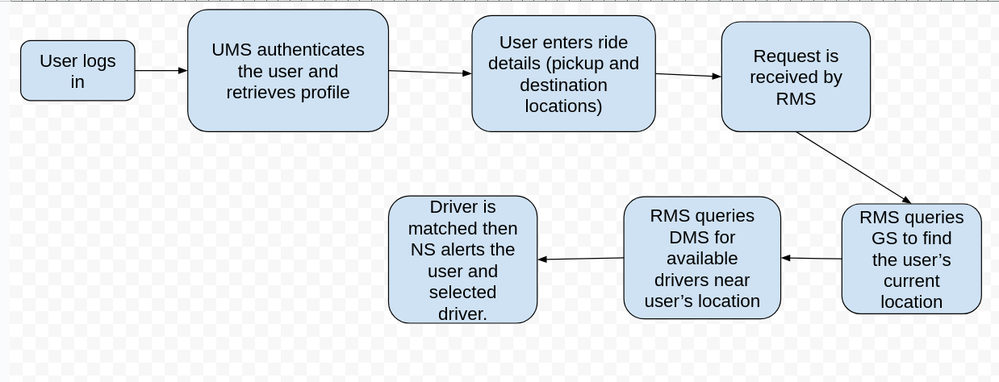

# Go Ride Sharing Microservices

> A practical ride-sharing sample, built with Golang and different technologies like Postgresql, Cassandra, Kubernetes, Docker, opentelemetry, Envoy Proxy, Uber's H3, Kafka, gRPC. For communication between independent services we use gRPC.

💡 This application is in no way business oriented and the focus is mostly on technical part, just to implement a sample with using different technologies, software architecture design, principles and all the thing we need for creating microservices.

🚀 This Application is `in-progress` and I will add new features and technologies over time.

## Services
- `User Management Service (UMS):` Handles user registration, authentication and profile management.
- `Driver Management Service (DMS):` Manages driver registration, verification and profiles.
- `Ride Matching Service (RMS):` Responsible for matching riders with nearby drivers.
- `Geolocation Service (GS):` Provides real-time location tracking and mapping functionalities.
- `Notification Service (NS):` Sends notifications and alerts to users and drivers.

### User Management Service (UMS)
- `Interactions:` Communicates with the Ride Matching service and Notification Service
- `Database:` Postgresql; Handles structured data like the user profile

### Driver Management Service (DMS)
- `Interactions:` Communicates with the Ride Matching service and Notification Service
- `Database:` Postgresql; Handles structured data like the driver profile

### Ride Matching Service (RMS)
- `Interactions:` Core service interacting with User Management, Driver Management and Geolocation services
- `Database:` Cassandra; Needs to handle high-volume, write-intensive operations (ride requests, driver availability updates), which Cassandra handles well due to its high write throughput.

### Geolocation Service (GS)
- `Interactions:` Communicates with the Ride Matching service and Driver Management Service
- `Database:` Cassandra; Same as the Ride Matching Service

### Notification Service (NS)
- `Interactions:` Works with almost all the services for alerting users and drivers in real-time via websockets
- `Database:` Cassandra; Same as the Ride Matching Service

## Considerations
You might ask why I used Cassandra for the Geolocation service considering it does not natively support geospartial indexing
which makes it easier to perform queries based on longitude and latitude locations like Postgresql. Well I would choose to use
Cassandra here because of it's high availability, horizontal scalability and write performance which is beneficial for this
ride-sharing use-case where driver's locations are constantly being updated and written to the database.

The work around for Cassandra's lack of geospartial indexing would be using geohashing techniques which for this project I 
would be using Uber's H3 geospartial library. Why? I read about it on Uber's engineering blog and I found it really interesting
so I want to use it in this project.

## Other technologies
- `Kubernetes:` The services would all be deployed in a Kubernetes cluster.
- `Hashicorp Vault:` Hashicorp Vault would be deployed in the K8s cluster and configured to be used as a secret store for K8s External Secret Operator which would inject sensitive info like the database credentials.
- `Helm Charts:` Helm charts would be used to deploy all the services instead of K8s manifests.
- `ArgoCD:` ArgoCD would be used to setup one-click deployments once any code changes are merged into the GitHub repo and CI pipeline works successfully.
- `Observability Stack: ` Would setup PLG(Promtail, Loki, Grafana) stack along with Prometheus for metrics monitoring. the applications alongside it's dependent services would be monitored.

### Future
In Future we would add an extra twist to the ride sharing process to allow 2 users going to similar destinations share a
ride by using some path matching algorithm to match the similar destination routes and match them with thesame driver to share a ride.
